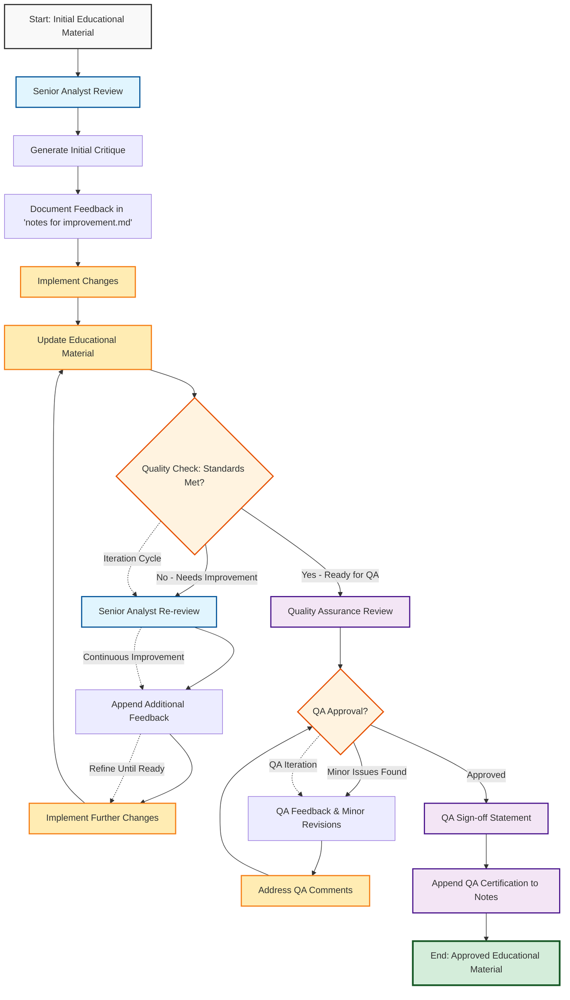

# Educational Content Restructuring Prompt

## Context

This prompt is designed for restructuring raw educational materials (transcripts, PDFs, ZIP demos) into comprehensive, well-organized learning modules with progressive tutorials, following an iterative quality improvement process.

## Educational Material Restructuring Workflow

### Objective
To iteratively refine and improve educational materials through a structured process of expert critique, implementation, and quality assurance.

### Roles
- **Author**: The initial creator of the educational content
- **Senior Data Analyst (Reviewer)**: Provides expert critique and suggestions for improvement
- **Implementer**: Applies the suggested changes to the material
- **Quality Assurance (QA)**: Provides a final sign-off on the quality of the material

### Process Workflow



### Workflow Steps

#### Phase 1: Initial Review Cycle
1. **Initial Material**: Complete draft of educational content
2. **Senior Analyst Review**: Expert evaluates accuracy, clarity, flow, and technical depth
3. **Generate Initial Critique**: Feedback compiled into structured `notes for improvement.md`
4. **Implement Changes**: Revise material based on initial feedback
5. **Update Material**: Apply improvements to educational content

#### Phase 2: Iterative Improvement Loop
6. **Quality Check**: Assess if content meets educational standards
7. **Re-review (if needed)**: Senior analyst conducts additional review cycles
8. **Continuous Refinement**: Multiple iterations until quality standards are met
9. **Append Feedback**: All review cycles documented in notes file

#### Phase 3: Quality Assurance Cycle  
10. **QA Review**: Final quality assurance evaluation
11. **QA Iteration**: Minor revisions if needed (separate from content review)
12. **QA Sign-off**: Final certification when all standards are met
13. **Document Certification**: QA statement appended to notes
14. **Approved Material**: Final, approved educational content ready for use

**Key Feature**: The process includes **two distinct iteration loops**:
- **Content Improvement Loop**: Between steps 6-9 for subject matter refinement
- **QA Loop**: Between steps 10-12 for final quality certification

## The Task

**Objective:** Transform raw educational content into a structured learning experience with hands-on tutorials that progress from foundational understanding to practical application.

## Step-by-Step Instructions

### Phase 1: Content Analysis and Cleanup

1. **Examine the current structure** of the educational folder
2. **Remove transcript files** (TXT, VTT files) while preserving PDF slides and practical demonstrations  
3. **Extract and analyze ZIP demos** to understand the content and learning objectives
4. **Preserve PDF slides** as reference materials alongside tutorials
5. **Create a main README.md** that provides comprehensive theoretical foundation

### Phase 2: Structured README Creation

Create a comprehensive module README.md that includes:

#### Content Structure

- **Overview with process flow diagram** (Mermaid)
- **Data preparation section** explaining preprocessing steps with examples
- **Step-by-step conceptual progression** (e.g., Step 1: Concept A, Step 2: Concept B)
- **Key definitions and formulas** with clear explanations
- **Algorithm explanations with flowcharts** (Mermaid diagrams)
- **Metrics and evaluation criteria** with relationship diagrams
- **Business applications** with real-world examples and diagrams
- **Practical challenges and considerations** with decision trees
- **Modern applications and business value**

#### Visual Enhancements

- **Process flow diagrams** showing the overall workflow
- **Algorithm flowcharts** demonstrating step-by-step processes
- **Metrics relationship diagrams** showing how calculations connect
- **Business application maps** illustrating real-world uses
- **Threshold impact visualizations** showing trade-offs

### Phase 3: Progressive Tutorial Development

Create numbered tutorials in logical learning order:

#### Tutorial Naming Convention

- `00-manual-calculation-tutorial/` - **Foundation level**
- `01-[concept-name]-tutorial/` - **Basic implementation**  
- `02-[advanced-concept]-tutorial/` - **Advanced applications**

#### Tutorial Structure for Each

- **Comprehensive README.md** with:
  - Learning objectives
  - Prerequisites  
  - Step-by-step tutorial structure
  - Key concepts explained
  - Expected outputs
  - Next steps
- **Interactive Jupyter notebook** with working examples
- **Practice exercises** (where applicable)

### Phase 4: Manual Calculation Tutorial (Critical Addition)

**Always include a `00-manual-calculation-tutorial/`** containing:

#### Files Required

1. **README.md** with:
   - Small, manageable dataset (5-8 examples)
   - Complete manual calculations showing every step
   - Hand calculation tables
   - Step-by-step algorithm execution without libraries
   - Detailed metric calculations (support, confidence, lift, etc.)
   - Threshold impact analysis
   - Key insights and interpretations

2. **Interactive workbook (`manual-calculation-workbook.ipynb`)**:
   - Pure Python implementation (minimal libraries)
   - Function-by-function breakdown
   - Verification against manual calculations  
   - Experimentation tools for different parameters
   - Educational comments explaining each step

3. **Practice exercises (`practice-exercises.md`)**:
   - Progressive difficulty (5+ exercises)
   - Detailed solutions with explanations
   - Real-world business scenarios
   - Advanced challenges for deeper understanding

### Phase 5: Quality Assurance

#### Content Verification

- **Ensure mathematical accuracy** in all calculations
- **Verify code functionality** in all notebooks
- **Check logical progression** from basic to advanced
- **Validate business examples** for real-world relevance

#### Educational Effectiveness

- **Clear learning objectives** for each tutorial
- **Appropriate difficulty progression**
- **Practical applicability** of examples
- **Comprehensive coverage** of key concepts

## Key Success Principles

### 1. **Progressive Learning Path**

- Start with manual understanding (00-manual)
- Progress to library usage (01-basic)
- Advance to complex applications (02-advanced)

### 2. **Deep Conceptual Understanding**

- Always include manual calculations first
- Show the "why" behind algorithms
- Connect theory to practical business value

### 3. **Visual Learning Support**

- Use Mermaid diagrams extensively
- Create flowcharts for complex processes
- Include relationship diagrams for metrics

### 4. **Hands-On Practice**

- Interactive notebooks with working code
- Practice exercises with solutions
- Real-world business scenarios

### 5. **Professional Documentation**

- Clear README files for each component
- Comprehensive guides with learning objectives
- Professional formatting and structure

## Expected Deliverables

### Folder Structure

```text
module-X-[topic-name]/
├── README.md (comprehensive guide with Mermaid diagrams)
├── [topic-name].pdf (preserved reference slides)
├── 00-manual-calculation-tutorial/
│   ├── README.md
│   ├── manual-calculation-workbook.ipynb
│   └── practice-exercises.md
├── 01-[basic-concept]-tutorial/
│   ├── README.md
│   └── [notebook].ipynb
├── 02-[advanced-concept]-tutorial/
│   ├── README.md
│   └── [notebook].ipynb
└── notes for improvement.md (iterative feedback and QA sign-off)
```

### Quality Standards

- **Educational value**: Clear progression from novice to competent
- **Technical accuracy**: All calculations and code verified
- **Business relevance**: Real-world applications and examples
- **Visual clarity**: Effective use of diagrams and formatting
- **Practical utility**: Hands-on exercises and implementations

## Template Phrases for Consistency

### README Sections

- "This module introduces the fundamental concepts of..."
- "Follow these tutorials in order for a complete understanding:"
- "By completing this module, you will understand:"
- "Key Concepts", "Business Applications", "Practical Challenges"

### Tutorial Descriptions

- "**Start Here**: Learn by doing calculations manually without libraries"
- "**Next**: Learn the fundamentals of [concept] with libraries"
- "**Build Upon**: [Previous concept] to generate [advanced concept]"

## Success Metrics

A successful restructuring will:

1. **Enable self-directed learning** through clear progression
2. **Build deep understanding** via manual calculations
3. **Connect theory to practice** through business examples
4. **Provide practical skills** through hands-on coding
5. **Support different learning styles** via multiple formats (text, visual, interactive)
6. **Follow iterative improvement** through expert critique and QA processes

---

## Usage Instructions

When you receive new educational materials:

1. **Paste this prompt** to Claude Code
2. **Specify the folder path** containing raw materials
3. **Mention any specific learning objectives** or constraints
4. **Let Claude Code execute** the full restructuring process
5. **Apply the iterative improvement workflow** with expert critique
6. **Document feedback** in `notes for improvement.md`
7. **Obtain QA sign-off** before finalizing

This systematic approach ensures consistent, high-quality educational experiences across all modules through rigorous quality assurance processes.
