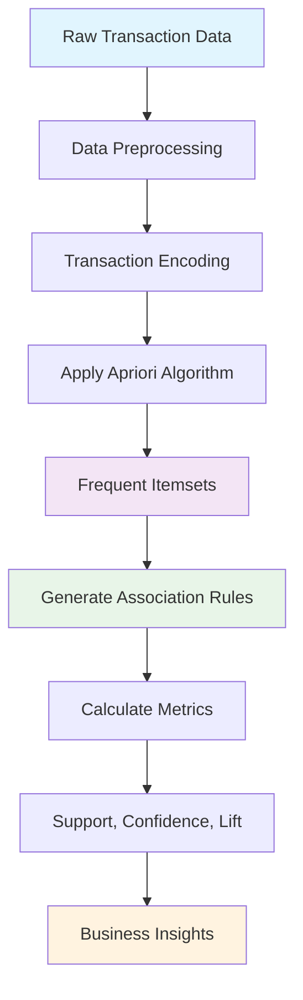
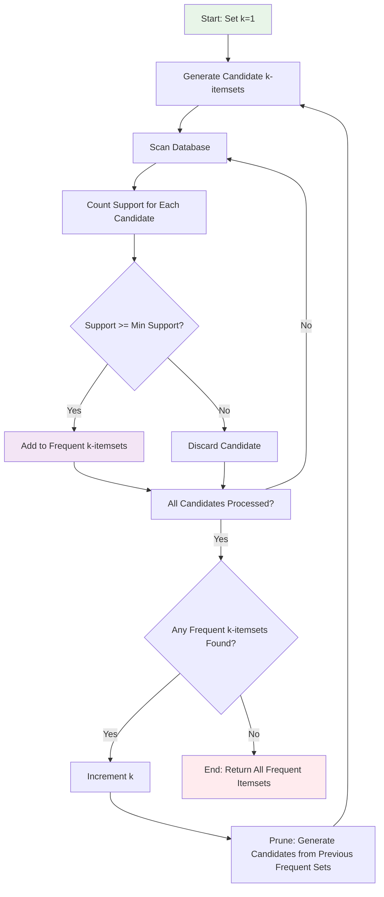
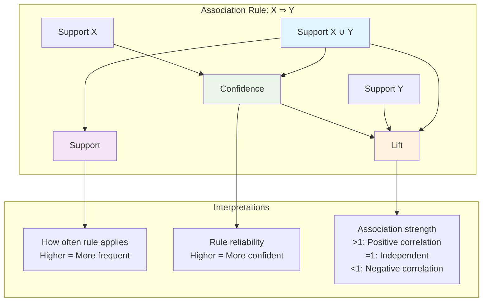
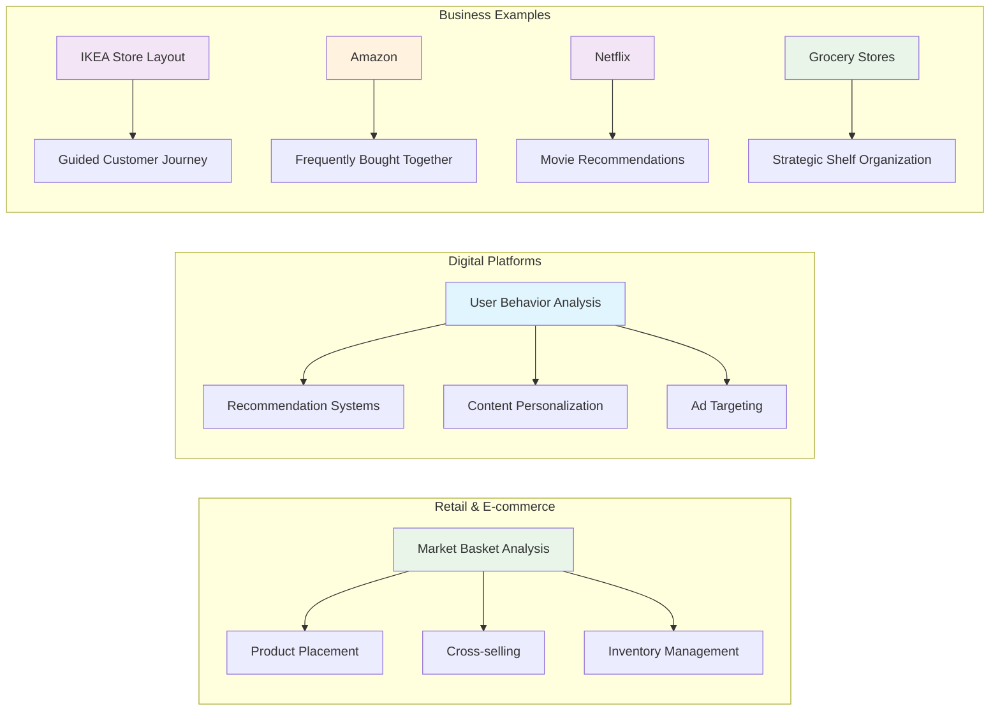
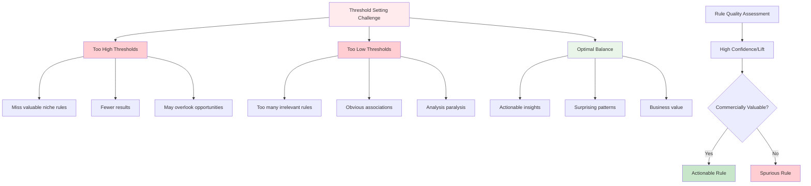

# Module 1: Introduction to Frequent Pattern Analysis

## Overview
This module introduces the fundamental concepts of frequent pattern mining, a technique used to discover relationships and associations among variables in large datasets. We will focus on the process of identifying frequent itemsets and generating association rules, with a primary emphasis on market basket analysis and its modern applications.



## Data Preparation

Before we can begin mining frequent patterns, we need to transform our raw data into a suitable format for analysis. This preprocessing step is crucial for successful pattern mining.

### Raw Data Transformation
- **Raw Data**: Typically comes as sales records, web logs, or transaction lists
- **Transaction Format**: Must be converted into a list of transactions, where each transaction contains items
- **One-Hot Encoding**: Transform transactions into a binary matrix where each column represents an item and each row represents a transaction

### Example Transformation
```
Raw Sales Data:
- Customer 1: Milk, Bread, Eggs
- Customer 2: Bread, Eggs, Butter
- Customer 3: Milk, Eggs

Becomes Transaction List:
[['Milk', 'Bread', 'Eggs'], ['Bread', 'Eggs', 'Butter'], ['Milk', 'Eggs']]

Then One-Hot Encoded:
   Bread  Butter  Eggs   Milk
0   True   False  True   True
1   True    True  True  False
2  False   False  True   True
```

This preprocessing step ensures that the data is in the correct format for frequent itemset mining algorithms.

## Step 1: Finding Frequent Itemsets

### Core Concepts
- **Transaction**: A single event or record, such as a customer's purchase or a web session.
- **Itemset**: A collection of one or more items within a transaction.
- **Frequent Itemset**: An itemset that appears in a minimum number of transactions, defined by a "support threshold."

### The Support Metric
Support measures the frequency of an itemset in the dataset. It is calculated as:
> **Support(X) = (Number of transactions containing itemset X) / (Total number of transactions)**

### The Apriori Principle
The Apriori principle is a core property of frequent itemsets that states:
> If an itemset is frequent, then all of its subsets must also be frequent.

This principle allows us to efficiently prune the search space and is the foundation for many frequent pattern mining algorithms.



## Step 2: Generating Association Rules from Frequent Itemsets
Once frequent itemsets are identified, we can generate association rules from them. These rules help us understand the relationships between items.

### Rule Format
An association rule has the format **X ⇒ Y**, where:
- **X** is the antecedent (the itemset we start with).
- **Y** is the consequent (the itemset we expect to see).

### Rule Evaluation Metrics
To evaluate the strength and reliability of these rules, we use several key metrics:



**Detailed Metrics:**

- **Support (X ⇒ Y)**: The fraction of transactions containing both X and Y. This tells us how often the rule is applicable.
  > **Support(X ⇒ Y) = Support(X ∪ Y)**

- **Confidence**: The probability of seeing Y when X is present. This measures the rule's reliability.
  > **Confidence(X ⇒ Y) = Support(X ∪ Y) / Support(X)**

- **Lift**: The ratio of the observed support to that expected if X and Y were independent. This measures the strength of the association.
  > **Lift(X ⇒ Y) = Confidence(X ⇒ Y) / Support(Y)**
  > - A lift value > 1 indicates a positive correlation (the items appear together more often than expected).
  > - A lift value < 1 indicates a negative correlation.
  > - A lift value = 1 indicates no correlation.

## Applications & Business Value

### Market Basket Analysis
- **Original concept**: Understanding what customers buy together.
- **Examples**:
  - Milk + Cereal/Bread (breakfast items)
  - Sugar + Eggs (baking ingredients)

### Modern Applications



**Real-World Applications:**
- **Retail layout**: IKEA's strategic product placement to guide the customer journey.
- **E-commerce**: Amazon's "Frequently Bought Together" recommendation system.
- **Streaming services**: Netflix's movie and show recommendations.
- **Convenience stores**: Strategic shelf organization to maximize cross-selling.

### Business Impact
- **Customer convenience**: Grouping related items together.
- **Sales optimization**: Identifying and promoting cross-selling opportunities.
- **Inventory management**: Understanding product relationships to inform stock levels.
- **Marketing strategy**: Creating targeted recommendations and personalized offers.

## Practical Challenges & Considerations



**Key Considerations:**
- **Threshold Setting**: The choice of minimum support and confidence thresholds is critical.
  - **Too high**: You may miss valuable or niche rules.
  - **Too low**: You may be flooded with thousands of irrelevant or obvious rules.
- **Actionable vs. Spurious Rules**: A rule with high confidence or lift is not always commercially valuable. For example, `{Bread} ⇒ {Butter}` is a high-confidence rule but is too obvious to be actionable. The goal is to find surprising, unexpected, and actionable insights. A classic (though perhaps apocryphal) example of an actionable rule was `{Diapers} ⇒ {Beer}`, which suggested that fathers buying diapers late at night were also likely to buy beer, leading a store to place these items closer together.
- **Algorithm Efficiency**: While Apriori is foundational and excellent for learning, for very large datasets, more memory-efficient algorithms like **FP-Growth** (Frequent Pattern Growth) are often preferred as they avoid the costly candidate generation step of Apriori.

## Hands-on Tutorials
Follow these tutorials in order for a complete understanding:

### 00-manual-calculation-tutorial/
**Start Here**: Learn by doing calculations manually without libraries
- Master the concepts through step-by-step hand calculations
- Understand support, confidence, and lift through small examples
- Implement Apriori algorithm from scratch in pure Python
- Practice with exercises and real-world scenarios
- **Files**: Comprehensive guide + interactive workbook + practice exercises

### 01-frequent-patterns-tutorial/
**Next**: Learn the fundamentals of frequent itemset mining with libraries
- Understand the concept of frequent itemsets and support metrics
- Implement the Apriori algorithm for pattern discovery
- Set appropriate minimum support thresholds
- Analyze patterns in transactional data
- **Files**: Jupyter notebook with step-by-step implementation + comprehensive guide

### 02-association-rules-tutorial/
**Next**: Build upon frequent itemsets to generate association rules
- Generate rules from frequent itemsets discovered in tutorial 01
- Calculate and interpret confidence and lift metrics
- Evaluate rule strength and business significance
- Apply rules for recommendation systems and cross-selling
- **Files**: Complete implementation notebook + detailed tutorial guide

## Learning Outcomes
By completing this module, you will understand:
1. The process of finding frequent itemsets and generating association rules.
2. How to define and calculate support, confidence, and lift.
3. The importance of the Apriori principle in mining algorithms.
4. The practical challenges and business applications of frequent pattern analysis.
